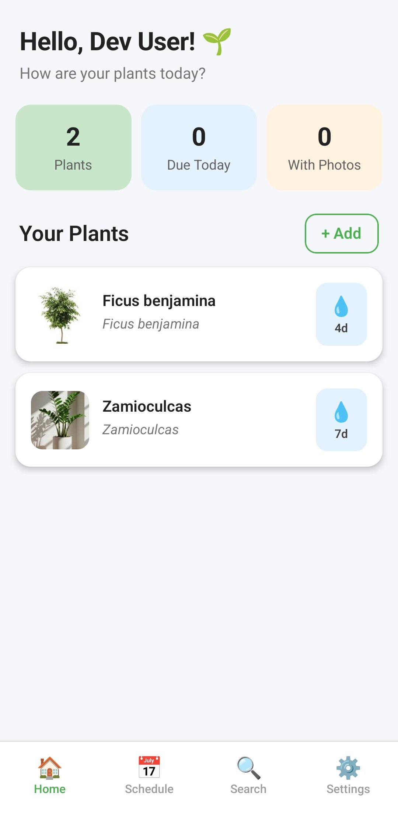

# 🌿 Plant Care Assistant

A mobile app built with **Expo** and **React Native** that helps you take care of your plants — schedule watering, identify plants, track growth with photos, and get weather-based care tips.



## ✨ Features

- **Plant Identification** — Identify plants from photos
- **Care Schedule** — Set watering reminders and track care routines
- **Photo Timeline** — Document your plant's growth over time
- **Weather Tips** — Get weather-based plant care recommendations
- **Search & Discover** — Browse plant database with care info
- **Notifications** — Never miss a watering session

## 🚀 Tech Stack

- **Framework:** [Expo](https://expo.dev) SDK 54
- **UI:** React Native with TypeScript
- **Navigation:** React Navigation (native stack + bottom tabs)
- **State Management:** MobX
- **Backend:** Firebase (Auth, Firestore, Storage)
- **Architecture:** Feature-Sliced Design (FSD)

## 📱 Getting Started

### What is Expo?

[Expo](https://expo.dev) is an open-source framework for building cross-platform mobile apps with React Native. It simplifies development by handling native builds, providing a managed workflow, and offering tools like **Expo Go** — a sandbox app that lets you run your project on a physical device instantly by scanning a QR code.

### Prerequisites

1. **Node.js** (>= 18)
   ```sh
   node --version
   ```
   If not installed, download from [nodejs.org](https://nodejs.org/).

2. **Expo CLI** (comes with the project, no global install needed — just use `npx`)

3. **Expo Go app** on your phone:
   - [Download for iOS](https://apps.apple.com/app/expo-go/id982107779)
   - [Download for Android](https://play.google.com/store/apps/details?id=host.exp.exponent)

### Install & Run

```sh
# 1. Clone the repo
git clone git@github.com:albertildarovich/plantcareassistant.git
cd plantcareassistant

# 2. Install dependencies
npm install

# 3. Start the Expo dev server
npx expo start
```

After running `npx expo start`, a QR code will appear in the terminal.

- **On your phone:** Open **Expo Go** → tap **Scan QR Code** → point at the terminal.
- **On an emulator:** Press `a` for Android or `i` for iOS in the terminal.

The app will load on your device. Any code changes you make will hot-reload automatically.

### Other Commands

```sh
# Clear Metro bundler cache (useful if you see weird errors)
npx expo start --clear

# Run on Android (requires Android Studio / emulator)
npm run android

# Run on iOS (requires Xcode / simulator)
npm run ios

# Run on web
npm run web
```

## 🏗 Project Structure

```
src/
├── app/            # App entry, providers, routes
├── entities/       # Business entities (plant, user)
├── features/       # Feature modules (water schedule, identify, etc.)
├── pages/          # Screen components
├── shared/         # Shared UI, config, lib, types
└── widgets/        # Reusable UI widgets
```

## 🔧 Development Mode

Currently, Firebase auth is bypassed for development. A mock user is automatically logged in so you can test the app without configuring Firebase.

To enable real Firebase auth, edit `src/entities/user/model/userStore.ts` and restore the original `checkAuthState()` method.

## 📄 License

MIT